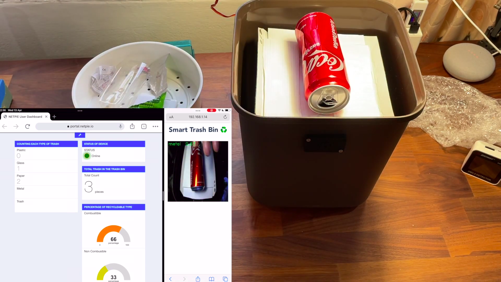

# **PROYEK SENIOR TI** 📌

📍 **Departemen Teknologi Elektro dan Teknologi Informasi, Fakultas Teknik, Universitas Gadjah Mada**

---

## **👥 Anggota Tim**

### **Benaya Imanuela**

- 🆔 **NIM:** 22/494790/TK/54313
- 🏆 **Role:** UI/UX Designer, Software Engineer 🎨💻

### **Nur Rochman**

- 🆔 **NIM:** 22/493623/TK/54086
- 🏆 **Role:** AI Engineer, Cloud Engineer 🤖☁️

---

## **📌 Nama Produk:** **Sortify**

🖥️ **Jenis Produk:** Layanan Software untuk mengelola proses penyortiran sampah secara otomatis

---

## **🌍 Latar Belakang**

♻️ **Masalah Pengelolaan Sampah:**

- Sampah yang tidak terpilah dengan baik masih menjadi **masalah utama** dalam pengelolaan lingkungan.
- Kurangnya **edukasi** dan **fasilitas** menyebabkan sampah organik, anorganik, dan bahan berbahaya bercampur.
- Pemilahan manual masih kurang efektif dan berkontribusi terhadap peningkatan **volume sampah di TPA**.

💡 **Solusi yang Dibutuhkan:**

- Teknologi **berbasis AI** yang bisa membantu masyarakat memilah sampah dengan **mudah dan cepat**.
- Sistem yang mampu mengenali jenis sampah melalui **image processing**.
- Hasil klasifikasi ditampilkan dalam **antarmuka web** sehingga dapat diakses dari berbagai perangkat dengan **koneksi internet**.

---

## **❓ Rumusan Permasalahan**

1️⃣ **Bagaimana mengembangkan model AI berbasis image processing yang dapat mengenali dan mengklasifikasikan sampah dengan akurat?**  
2️⃣ **Bagaimana merancang sistem berbasis jaringan komputer yang memungkinkan pengguna mengakses layanan klasifikasi sampah secara real-time?**  
3️⃣ **Bagaimana mengintegrasikan AI dengan layanan cloud agar pemrosesan gambar dan penyimpanan data efisien serta dapat diakses kapan saja?**  
4️⃣ **Bagaimana memastikan aplikasi web memiliki antarmuka yang ramah pengguna serta dapat diakses di berbagai perangkat dan jaringan?**

---

## **🚀 Solusi yang Ditawarkan**

✅ **AI untuk Klasifikasi Sampah:**

- Menggunakan **model klasifikasi** untuk membedakan sampah yang **dapat didaur ulang dan tidak**.

✅ **Deploy Backend dan AI di Cloud:**

- Model AI dan kode backend **di-deploy di cloud** agar dapat diakses melalui **REST API/WebSocket** oleh frontend.

✅ **Koneksi dengan Perangkat Keras:**

- Frontend berjalan di **lokal/Raspberry Pi** dan terkoneksi dengan **ESP32** melalui koneksi **serial** untuk menggerakkan **servo**.
- **Servo bergerak** berdasarkan input kamera yang diproses oleh model AI:
  - **0 → kiri (sampah tidak bisa didaur ulang)**
  - **1 → kanan (sampah bisa didaur ulang)**
  - **Default: tengah**

✅ **Potensi Implementasi:**

- **B2B (Business-to-Business)** → Membantu **perusahaan** atau **pemerintah** dalam mengelola sampah secara lebih optimal.

---

## **🔧 Rancangan Fitur Solusi**

| 🛠️ **Fitur**                | 📜 **Keterangan**                                                                             |
| --------------------------- | --------------------------------------------------------------------------------------------- |
| 📸 **Klasifikasi Sampah**   | Membedakan mana sampah yang dapat didaur ulang dan tidak berdasarkan input gambar             |
| 📊 **Dashboard Monitoring** | Mengakumulasi total sampah dan persentase yang dapat didaur ulang untuk analisis lebih lanjut |

---

## **⚖️ Analisis Kompetitor**

### **🛠️ KOMPETITOR 1: Trashbot by CleanRobotics**

🗂 **Jenis:** Direct Competitor  
📌 **Jenis Produk:** Smart Trash Bin berbasis AI

🎯 **Target Customer:**

- Perusahaan dan institusi yang ingin menerapkan **teknologi daur ulang otomatis**.
- Pemerintah daerah dengan konsep **smart city**.

💪 **Kelebihan:**  
✔️ Teknologi AI dapat memilah sampah secara **real-time**.  
✔️ Terintegrasi dengan **sistem smart waste management**.  
✔️ Meminimalisir kesalahan manusia dalam memilah sampah.

❌ **Kekurangan:**

- Produk berbentuk **hardware**, bukan aplikasi web.
- Harga **mahal** dan sulit diimplementasikan di **rumah tangga**.
- Tidak tersedia di semua negara.

🔥 **Unique Value Proposition:**  
✅ **Sistem pemilahan sampah berbasis AI** tetapi kurang fleksibel karena berbentuk hardware dengan harga mahal.

---

### **🛠️ KOMPETITOR 2: EcoBin**

🗂 **Jenis:** Direct Competitor  
📌 **Jenis Produk:** Tempat Sampah Pintar berbasis AI dan IoT

🎯 **Target Customer:**

- **Pemerintah kota** yang ingin meningkatkan efisiensi pengelolaan sampah.
- **Komunitas** dan **institusi** yang peduli terhadap lingkungan.

💪 **Kelebihan:**  
✔️ **Pemilahan sampah otomatis** menggunakan sensor dan pemrosesan data.  
✔️ **Pemantauan kapasitas tempat sampah** secara real-time.  
✔️ Mendukung **pengelolaan sampah yang efisien**.

❌ **Kekurangan:**

- Memerlukan **investasi infrastruktur** untuk implementasi.
- Fokus pada **hardware**, kurang fleksibel dibandingkan solusi berbasis **aplikasi**.

🔥 **Unique Value Proposition:**  
✅ **Integrasi AI dan IoT dalam bentuk fisik** untuk pemilahan sampah otomatis.

---

### **🛠️ KOMPETITOR 3: SMASH (Smart Mobile Application for Smart Handling)**

🗂 **Jenis:** Direct Competitor  
📌 **Jenis Produk:** Aplikasi Manajemen Sampah Berbasis Mobile

🎯 **Target Customer:**

- **Masyarakat umum** yang ingin terhubung dengan **bank sampah**.
- **Pemerintah daerah** yang membutuhkan sistem manajemen sampah.

💪 **Kelebihan:**  
✔️ **Menghubungkan pengguna** dengan **bank sampah terdekat**.  
✔️ Menyediakan informasi **jenis sampah yang diterima** oleh bank sampah.  
✔️ Fitur **e-Smash** untuk manajemen sampah di tingkat pemerintah daerah.

❌ **Kekurangan:**

- **Tidak memiliki fitur pemilahan sampah otomatis berbasis AI**.
- Bergantung pada **partisipasi aktif** dari bank sampah dan pengguna.

🔥 **Unique Value Proposition:**  
✅ **Menghubungkan masyarakat dengan bank sampah** melalui aplikasi mobile.

---

## **💡 Kesimpulan**

**Sortify** hadir sebagai **solusi inovatif** berbasis **AI, cloud computing, dan IoT** yang dapat membantu masyarakat memilah sampah secara **otomatis dan efisien**. Dengan solusi ini, kami berharap dapat meningkatkan **kesadaran masyarakat** dalam memilah sampah serta membantu **pemerintah dan perusahaan** dalam mengelola sampah dengan lebih optimal! 🚀🌱

---

## **📚 Referensi**

1. Sitinut Waisara. (2025, Februari 15). Smart Trash Bin with Waste separator. YouTube. [https://youtu.be/33T43l-gu78?si=5xhUgkeN2CLo4s3u](https://youtu.be/33T43l-gu78?si=5xhUgkeN2CLo4s3u)

2. Yusuf, Y. Y. N., Arbaatun, C. N., & Prawita, F. N. (2020). MATRASH: Pemanfaatan machine learning pada smart trash bin berbasis IoT yang terintegrasi dengan bank sampah. Universitas Telkom. Diakses dari [https://openlibrary.telkomuniversity.ac.id/pustaka/files/162087/jurnal_eproc/matrash-pemanfaatan-machine-learning-pada-smart-trash-bin-berbasis-iot-yang-terintegrasi-dengan-bank-sampah.pdf](https://openlibrary.telkomuniversity.ac.id/pustaka/files/162087/jurnal_eproc/matrash-pemanfaatan-machine-learning-pada-smart-trash-bin-berbasis-iot-yang-terintegrasi-dengan-bank-sampah.pdf)

---
